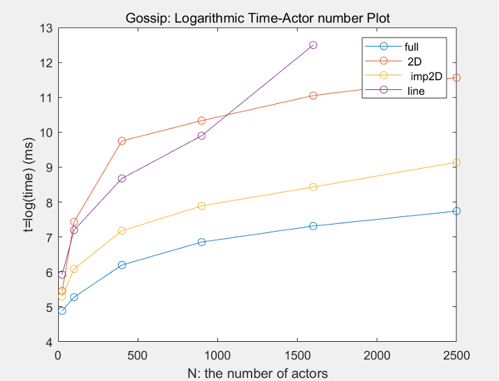
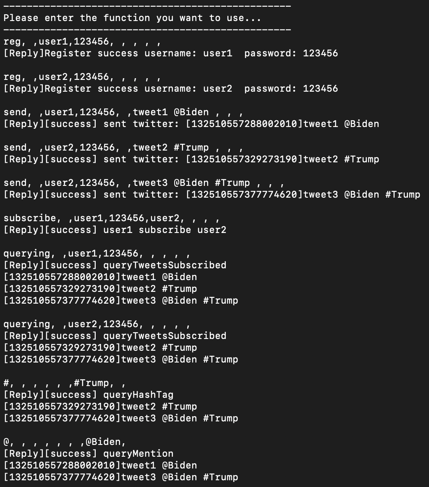
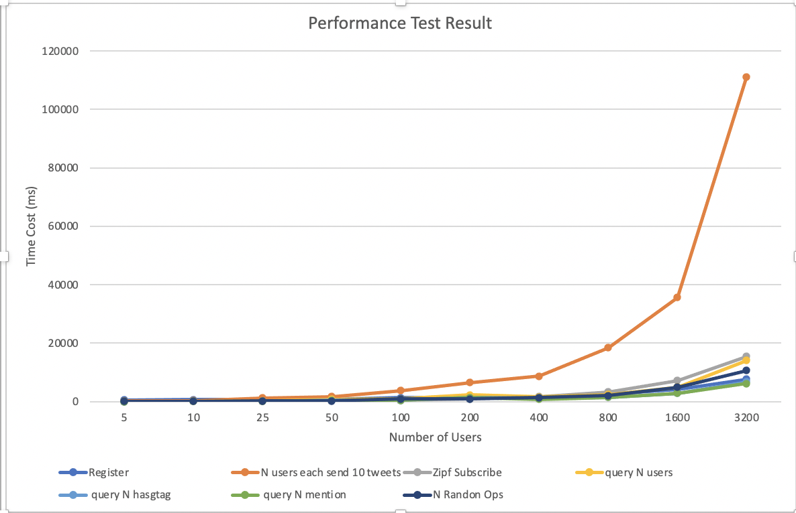
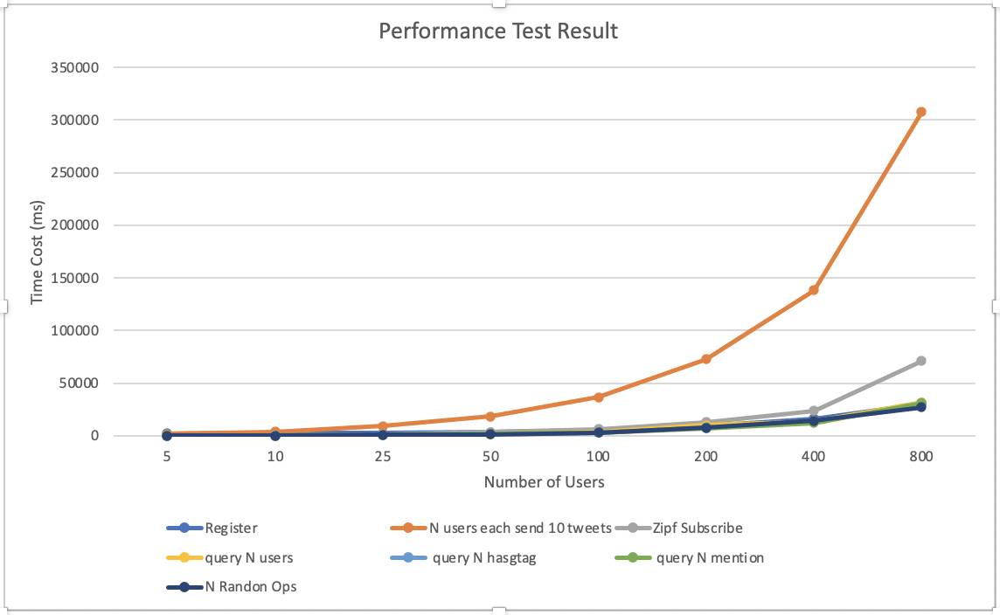

## Introduction

This is my Distributed Operating System Principle projects

## Group members :
- Jiajing Liao, 01469951
- Jingzhou Hu, 11319238

## Environment and Version:
- F#
- Akka
    - Akka 1.2.3
    - Akka.FSharp 1.2.3
    - FsPickler 3.4.0
- ASP.Net core - 3.1.403

## IDE and Machine
- JetBrains Rider 2020.2.2
- MacBook Pro 2.3 GHz Dual-Core Intel Core i5
    - OS Name:     Mac OS X
    - OS Version:  10.15
    - OS Platform: Darwin

# DOSP project 1

## Usage:
```
dotnet fsi proj1.fsx 3 2
dotnet fsi proj1.fsx 40 24
dotnet fsi proj1.fsx 1000000 4
dotnet fsi proj1.fsx 10000000 24
```

## 1. As table below, the best size of work unit is: 10000
|     n           |     k     |    *workSize    |     # of Threads    |     realTime    |     CPUTime    |     timeRatio     |
|-----------------|-----------|-----------------|---------------------|-----------------|----------------|-------------------|
|     10000000    |     24    |     10000000    |     1               |     8.07        |     8.151      |     0.99006257    |
|     10000000    |     24    |     1000000     |     10              |     6.53        |     13.275     |     0.49190207    |
|     10000000    |     24    |     100000      |     100             |     6.683       |     13.514     |     0.4945242     |
|     10000000    |     24    |    *10000       |     1000            |     6.207       |     13.083     |    *0.47443247    |
|     10000000    |     24    |     1000        |     10000           |     7.154       |     13.49      |     0.53031875    |
|     10000000    |     24    |     100         |     100000          |     10.458      |     17.536     |     0.59637318    |
|     10000000    |     24    |     10          |     1000000         |     15.286      |     23.454     |     0.65174384    |
|     10000000    |     24    |     1           |     10000000        |     01:26.5     |     01:44.9    |     0.82463696    |


## 2.
					
dotnet fsi proj1.fsx 1000000 4
OUTPUT:  Nothing

## 3.
real Time:  0.232s 
CPU Time: 0.442s
Ratio = 0.52
 
					


## 4. 
```
The largest problem you managed to solve:    10^8
dotnet fsi proj1.fsx 100000000 24
Results: 
1 9 20 25 44 76 121 197 304 353 540 856 1301 2053 3112 3597 5448 8576 12981 20425 30908 35709 54032 84996 128601 202289 306060 353585 534964 841476 1273121 2002557 3029784 3500233 5295700 8329856 12602701 19823373 29991872 34648837 52422128 82457176
Time: Real: 00:01:08.188, CPU: 00:02:18.363	
```
		 	 		
					

# project2

## Introduction:
In this project, we implement the 2 algorithms:
- gossip
- push-sum

## How to run the code:
```
// topo= "full", topo= "2D", topo= "line", topo= "imp2D" 
// algorithm = "gossip" or "push-sum"
dotnet fsi --langversion:preview proj2.fsx 10 full gossip
dotnet fsi --langversion:preview proj2.fsx 10 imp2D push-sum
```

## Results



# project3

## Team
- Jiajing Liao, 01469951
- Jingzhou Hu, 11319238

## What is working:

- We diversely generate *numNodes* actors
- At each second, every node will send a message to a random address
- After *numRequests* seconds, the program will report the result and stop

### simplification statement
In this project, we implement the [Pastry](http://rowstron.azurewebsites.net/PAST/pastry.pdf), 
we made below change to make problem simple:
- Our ID range is from [0, 1000000000), this is more straightforward for human understanding.

- For example, when n=10, our code will generate Actor as: 000000000 100000000 200000000 300000000 400000000 500000000 600000000 700000000 800000000 900000000
- Our Code will generate Akka Actor in decimal, which means there is only 0, 1, 2, ..., 9.
- Above simplification has no impact to the final result. 
- we use a Trie to store the routing table, each time the node will compare it's own address with destination address, and then send the message to the first closest node in the Trie
- we use a modified decimal md5 as hash function, truncate leading 10 digits
## How to run the code:
```java
// dotnet fsi --langversion:preview project3.fsx numNodes numRequests
dotnet fsi --langversion:preview project3.fsx 10000 1
```
## What is the largest network you managed to deal with
the largest problem is as below:
```
numNodes is 100000 nodes
numRequests is 1 requests
Running time is: 157751.663500 ms
max hop is 5 hops
min hop is 0 hops
avg hop is 4.579850 hops
```

## Analysis
out data shows that the hops are O(log n)
which is reasonable because each time, the range will shrink by 2^b times.

When `numNodes` is small, numRequests will have impact to final result. However, when it is big, there is no much impact.

## Developing:
- F#
- Akka
    - Akka 1.2.3
    - Akka.FSharp 1.2.3
    - FsPickler 3.4.0
- ASP.Net core - 3.1.403
- JetBrains Rider 2020.2.2
- MacBook Pro 2.3 GHz Dual-Core Intel Core i5
    - OS Name:     Mac OS X
    - OS Version:  10.15
    - OS Platform: Darwin

## Graph Report


## Reference
- [Pastry](http://rowstron.azurewebsites.net/PAST/pastry.pdf)
- [Trie](https://blog.martindoms.com/2016/05/23/prefix-tree-trie-f-sharp)
- [MD5](http://www.fssnip.net/3D/title/MD5-hash)


# Project4 Part I

## Team
- Jiajing Liao, 01469951
- Jingzhou Hu, 11319238

## Description
We finish **all** functionality of Project4 Part I requirements.

#### Running options 1
There 3 files we provide in ./fsx
- `AkkaServer.fsx` is the server
- `AkkaClientOne.fsx` is the client
- `AkkaClient.fsx` is for performance test

#### Running options 2
you can also run .fs files in ./fs folder, this requires a Visual Studio or JetBrains Rider IDE

## Implementation
#### Client
We use Akka.actor heavily, the major responsibility of client is to send the message string to the server, and disply the result string to the screen
#### Server
We build Twitter Server basically by 3 Class: Tweet, User, and Twitter. 
- Tweet is the instance of tweet, identified by System time stamp
- User is the instance of User, identified by username
- Twitter is a Singleton instance, which is consist of many HashMap, in order to speed up the search for "#" and "@"

#### for "#" and "@", HashMap to speed up
Whenever a new Tweet is published, it will be parsed. If it contains "#" or "@", it will then be add to the HashMap.

#### Connecting and disconnecting
We use a `Long Pulling` techniques, every 1 seconds, the actor will try to query the tweets it subscribes, and if there is a difference to the previous result, it will be displayed to the screen

## How to use

#### Command Explanation
Our Client Command is consist of 9 String, seperated by comma ","

9 command format: 
**Very Important**
```
opt+","+POST+","+username+","+password+","+target_username+","+tweet_content+","+queryhashtag+","+at+","+register
```

In order to understand the means of below command, please look at below example 1


#### Example 1: Functionality
open 1st terminal as Server
```
dotnet fsi --langversion:preview AkkaServer.fsx
```

open 2nd terminal as Client
```
dotnet fsi --langversion:preview AkkaClientOne.fsx
```

Then Input Below Command line by line into CLient Terminal
```
reg, ,user1,123456, , , , ,
reg, ,user2,123456, , , , ,
send, ,user1,123456, ,tweet1 @Biden , , ,
send, ,user2,123456, ,tweet2 #Trump , , ,
send, ,user2,123456, ,tweet3 @Biden #Trump , , ,
subscribe, ,user1,123456,user2, , , ,
querying, ,user1,123456, , , , ,
querying, ,user2,123456, , , , ,
#, , , , , ,#Trump, ,
@, , , , , , ,@Biden,
```



#### Example 2: retweet
Input Below Command line by line into CLient Terminal
```
retweet, ,user2,123456, ,tweet3 @Biden #Trump , , , 
querying, ,user2,123456, , , , ,
```


#### Example 3: connect and disconnect
For this example, you can open `user1` as a terminal, open `user2` as another terminal. Then, since `user1` subscribes `user2`, the screen of `user1` will automatically refresh with the latest tweets of `user2`

After disconnecting, it will no longer refresh automatically.

```
connect, ,user1,123456, , , , ,
send, ,user2,123456, ,tweet4, , ,
send, ,user2,123456, ,tweet5, , ,
send, ,user2,123456, ,tweet6, , ,
disconnect, ,user1,123456, , , , ,
send, ,user2,123456, ,tweet7, , ,
```


#### Example 4: Performance Test
- Firstly, open a Server as mentioned above.
- Then, run below command, You can change the 125 to any integer, it represents the number of users
```
dotnet fsi --langversion:preview AkkaClient.fsx 125
```
`result10.txt` is Performance test result under 10 users

## Test Measure
All test result obtained from `.fs` file in Jetbrains Rider IDE.
We test time cost of 3 measures, below N is the number of all users:
- register N users
- send 10 tweets for all users, and simulate a Zipf number of subscribes, and query tweets for every users
- Zipf subscribe N users
- query N users
- query N hasgtag
- query N mention
- N random operations

## Result

#### time cost in 3 different test scales
All test result obtained from `.fs` file in Jetbrains Rider IDE.
(milliseconds)

- For N<400, we sent a tweet "tweet_content+useri_jth @user$ #topic$ " ($ means random)
- For N>=400, we sent a tweet "t"

| N    | Register  | N users each send 10 tweets | Zipf Subscribe | query N users |  query N hasgtag  |  query N mention | N Randon Ops |
|------|-----------|-----------------------------|----------------|---------------|-------------------|------------------|--------------|
| 5    | 599.6734  | 184.5998                    | 21.8749        | 51.1026       | 29.262            | 24.1199          | 51.5178      |
| 10   | 659.8578  | 387.1673                    | 50.5391        | 103.9618      | 47.1174           | 56.1817          | 53.2401      |
| 25   | 807.435   | 1191.5766                   | 128.7027       | 246.3215      | 128.7414          | 123.4499         | 171.5757     |
| 50   | 769.0788  | 1691.3756                   | 467.9807       | 764.2445      | 493.4429          | 338.9445         | 219.0232     |
| 100  | 1341.3728 | 3748.3057                   | 446.3389       | 930.0312      | 433.1106          | 449.2736         | 947.7343     |
| 200  | 1232.6446 | 6565.2218                   | 865.9617       | 2279.6697     | 1400.8518         | 1336.9309        | 867.6679     |
| 400  | 1486.0643 | 8704.6874                   | 1675.8635      | 1553.9948     | 1303.3077         | 741.304          | 1330.1301    |
| 800  | 2510.7779 | 18426.727                   | 3333.8554      | 2343.8812     | 1452.3169         | 1437.4424        | 2010.4858    |
| 1600 | 4214.8476 | 35609.2485                  | 7195.5841      | 4874.3492     | 2860.3245         | 2820.996         | 4934.7314    |
| 3200 | 7642.8433 | 111190.343                  | 15425.6988     | 14089.3911    | 6775.7368         | 6146.9854        | 10698.6298   |



#### number of subscribes, simulate a Zipf distribution


## What is the largest network you managed to deal with
the biggest number of users we tested is 3200

We change some cinfiguration under this scenario, tweet content is only a single character "t".


Result is as below
```
The time of register 3200 users is 7642.843300
The time of send 10 tweets is 111190.342900
The time of Zipf subscribe 3200 users is 15425.698800
The time of query 3200 users is 14089.391100
The time of query 3200 hasgtag is 6775.736800
The time of query 3200 mention is 6146.985400
The time of 3200 random operations is 10698.629800
```

## Analysis
Send Tweet cost the most of time, since server will have to parse "@user" and "#topic", this will cost tons of server time. As a result, it's the most time-consuming operations

Zipf Subscribe cost 2nd most time, since it requires total 2*N subscribes operations.

Query cost the 3nd most time, since it consists of tons of string transmission. This will cost a lot of time.

For other operations, it just need N operations, so they don't cost as much time as previous 3 operations.


## Environment

```
- FSharp.Core 3.0.2
- Akka.FSharp 1.2.0
- Akka.Remote 1.2.0
- FsPickler 1.2.21
```


# Project4 Part II

## Team
- Jiajing Liao, 01469951
- Jingzhou Hu, 11319238

## Youtube Video explanation
[https://youtu.be/x27j8ZsE_zE](https://youtu.be/x27j8ZsE_zE)

## Description
We finish **all** requirements of Project 4 Part II

Based on Project4 Part I, we developed a Websocket based API for our Twitter, it route to a specific link address, The body is a JSON string, the "command" field of the JSON will be the command for the Twitter Server, which is exactly the same as Project4 Part I:
```
http://127.0.0.1:8080/twitter

un-encrypted Body: {"command":"reg, ,user1,123456, , , , , "}

encrypted Body: {"command":"pOAbwGSJbIR3SrcUTVTEAu6eyHLzVtYdjibRnEEly570pqpIm6jaoFQbdBy2RTRCdCdnD94uYdE4O5ZpNrkhxXZnp8rFh7bh4XvaGxSvh0/0Bo8CAoKHgtChEOGmzEFG"}
```


We re-write parts of our server using WebSharper to implement the WebSocket interface, which is a extra layer for receiving Websocket Request

We re-write parts of our client to use WebSockets, we replace the AKKA actor to WebSockets sender.

#### Bonus Encryption
Due to the lack of support of RSA-2048 on Fsharp.(Actually we do have RSA-2048 version but there is some issue for F# support, so we choose other encryption method.)For the Encryption part, Ciphertext authenticity, based on.NET Framework, is verified with HMAC SHA256.(AS professor said, we can use some api: https://github.com/tasos-py/AES-Encryption-Classes, which is a Advanced Encryption Standard encryption with good F# support.)

After joining the Encryption, our program is relatively slow.

###### Encryption Display

Client:

```
[Before Encrypt]reg, ,user1,123456, , , , ,
[AfterEncrypted]pOAbwGSJbIR3SrcUTVTEAu6eyHLzVtYdjibRnEEly570pqpIm6jaoFQbdBy2RTRCdCdnD94uYdE4O5ZpNrkhxXZnp8rFh7bh4XvaGxSvh0/0Bo8CAoKHgtChEOGmzEFG
```

Server

```
[BeforeDecrypted:]pOAbwGSJbIR3SrcUTVTEAu6eyHLzVtYdjibRnEEly570pqpIm6jaoFQbdBy2RTRCdCdnD94uYdE4O5ZpNrkhxXZnp8rFh7bh4XvaGxSvh0/0Bo8CAoKHgtChEOGmzEFG
[decrypted Message:]reg, ,user1,123456, , , , ,
```


## Running
There 3 files we provide in ./fs
- `Server.fs` is the server
- `ClientOne.fs` is the client
- `Client.fs` is for performance test

You may run these files in Visual Studio or JetBrains Rider IDE

## Implementation
#### Client
The major responsibility of client is to send the message string to the server, and disply the result string to the screen
#### Server
We build Twitter Server basically by 3 Class: Tweet, User, and Twitter. 
- Tweet is the instance of tweet, identified by System time stamp
- User is the instance of User, identified by username
- Twitter is a Singleton instance, which is consist of many HashMap, in order to speed up the search for "#" and "@"

#### for "#" and "@", HashMap to speed up
Whenever a new Tweet is published, it will be parsed. If it contains "#" or "@", it will then be add to the HashMap.

#### Connecting and disconnecting
We use a `Long Pulling` techniques, every 1 seconds, the actor will try to query the tweets it subscribes, and if there is a difference to the previous result, it will be displayed to the screen

## How to use

#### Command Explanation
Our Client Command is consist of 9 String, seperated by comma ","

9 command format: 
**Very Important**
```
opt+","+POST+","+username+","+password+","+target_username+","+tweet_content+","+queryhashtag+","+at+","+register
```

In order to understand the means of below command, please look at below example 1


#### Example 1: Functionality
Run Server in Jetbrains Rider

Run Client1 in Jetbrains Rider

Run Client2 in Jetbrains Rider

Then Input Below Command line by line into CLient1 and Client2 Seperately
```
reg, ,user1,123456, , , , , 
reg, ,user2,123456, , , , ,
send, ,user1,123456, ,tweet1 @Biden , , ,
send, ,user2,123456, ,tweet2 #Trump , , ,
send, ,user2,123456, ,tweet3 @Biden #Trump , , ,
subscribe, ,user1,123456,user2, , , ,
querying, ,user1,123456, , , , ,
querying, ,user2,123456, , , , ,
#, , , , , ,#Trump, ,
@, , , , , , ,@Biden,
```


#### Example 2: retweet
Input Below Command line by line into CLient Terminal
```
retweet, ,user2,123456, ,tweet3 @Biden #Trump , , , 
querying, ,user2,123456, , , , ,
```


#### Example 3: connect and disconnect
For this example, you can open `user1` as a terminal, open `user2` as another terminal. Then, since `user1` subscribes `user2`, the screen of `user1` will automatically refresh with the latest tweets of `user2`

After disconnecting, it will no longer refresh automatically.

```
connect, ,user1,123456, , , , ,
send, ,user2,123456, ,tweet4, , ,
send, ,user2,123456, ,tweet5, , ,
send, ,user2,123456, ,tweet6, , ,
disconnect, ,user1,123456, , , , ,
send, ,user2,123456, ,tweet7, , ,
```


#### Example 4: Performance Test

`(All performance test is run without Encryption)`

- Firstly, open a Server as mentioned above.
- Then, run ClientPerformanceTest, You can change the 10 to any integer, it represents the number of users

`result10.txt` is Performance test result under 10 users

## Test Measure
All test result obtained from `.fs` file in Jetbrains Rider IDE.
We test time cost of 3 measures, below N is the number of all users:
- register N users
- send 10 tweets for all users, and simulate a Zipf number of subscribes, and query tweets for every users
- Zipf subscribe N users
- query N users
- query N hasgtag
- query N mention
- N random operations

## Result


#### time cost in different test scales
All test result obtained from `.fs` file in Jetbrains Rider IDE.
(milliseconds)

- For each user, we sent 10 tweets "tweet_content+useri_jth @user$ #topic$ " ($ means random)

| N   | Register   | N users each send 10 tweets | Zipf Subscribe | query N users |  query N hasgtag  |  query N mention | N Randon Ops |
|-----|------------|-----------------------------|----------------|---------------|-------------------|------------------|--------------|
| 5   | 2141.059   | 1895.5263                   | 264.5447       | 172.7906      | 177.4282          | 161.5666         | 159.6666     |
| 10  | 3018.0367  | 3693.2198                   | 599.6824       | 349.1778      | 360.9393          | 335.1666         | 310.3909     |
| 25  | 2803.3042  | 9416.3271                   | 1601.2634      | 861.9322      | 850.6924          | 846.5158         | 838.9885     |
| 50  | 3548.9732  | 18599.5518                  | 3276.9638      | 1727.1086     | 1660.3156         | 1621.459         | 1572.446     |
| 100 | 5210.7086  | 36686.9221                  | 6325.7602      | 3359.5298     | 3142.104          | 3216.4934        | 3232.4811    |
| 200 | 9259.367   | 72963.2182                  | 13100.1129     | 10090.295     | 8059.2591         | 7261.9787        | 7464.057     |
| 400 | 16382.2554 | 138322.962                  | 23674.4813     | 13669.3413    | 13222.7872        | 12277.181        | 14167.2872   |
| 800 | 30259.4236 | 307421.683                  | 71005.524      | 31688.8535    | 30536.8718        | 31437.4362       | 27319.604    |



#### number of subscribes, simulate a Zipf distribution


## What is the largest network you managed to deal with
the biggest number of users we tested is 800

## Analysis
Send Tweet cost the most of time, since server will have to parse "@user" and "#topic", this will cost tons of server time. As a result, it's the most time-consuming operations

Zipf Subscribe cost 2nd most time, since it requires total 2*N subscribes operations.

For other operations, it just need N operations, so they don't cost as much time as previous 3 operations.


The difference with Part I is that the overhead of query is not that significant, since WebSocket has bigger packet size than AKKA Message.


## Environment

```
- FSharp.Core 4.5.1
- Akka.FSharp 1.2.0
- Akka.Remote 1.2.0
- FsPickler 3.4.0

- websharper.fsharp: 4.6.0.361
- WebSharper.Suave: 4.6.0.240
- Suave: 2.5.3

- Fsharp.Data 3.0.1

```

```
- MacBook Pro
- 2.3 GHz Dual-Core Intel Core i5
- JetBrains Rider 2020.2
```