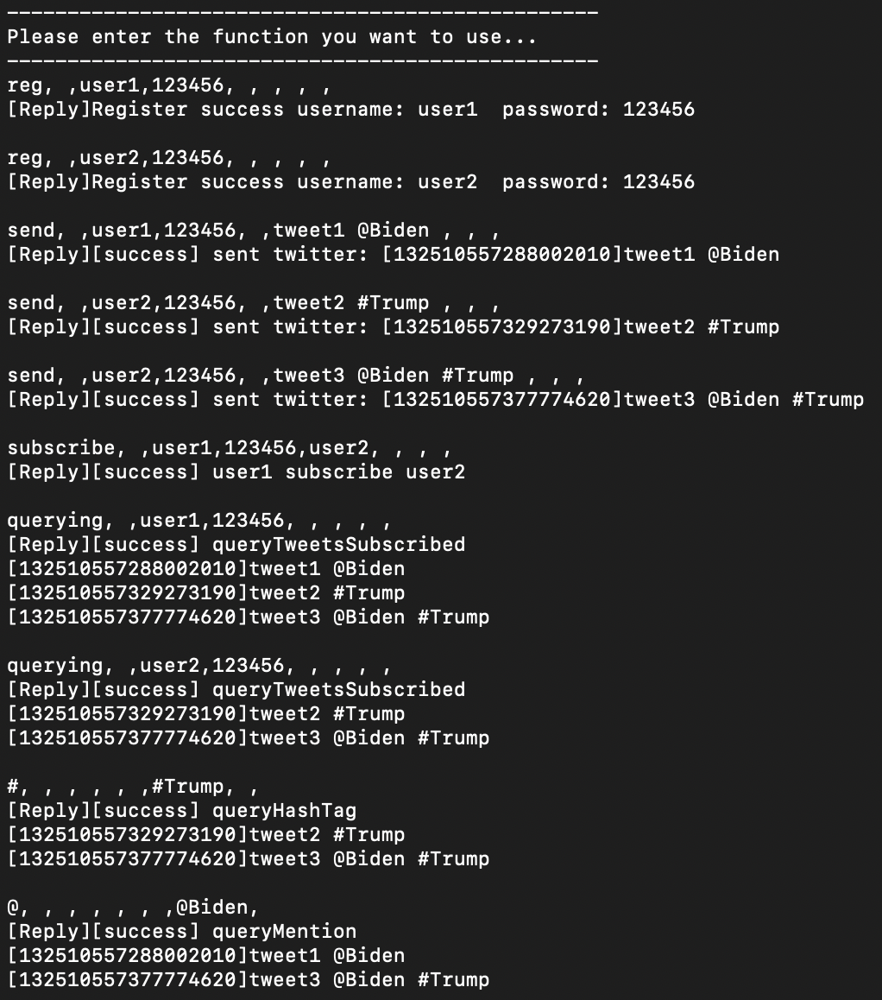
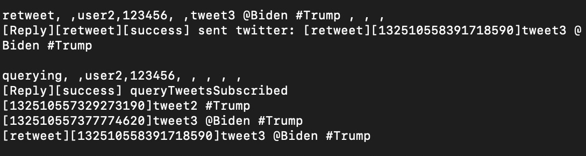
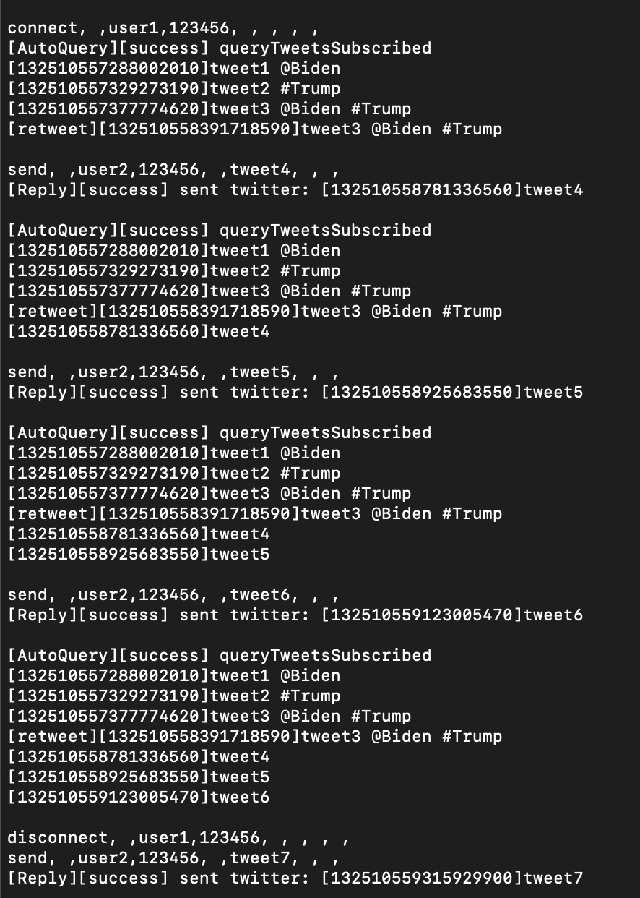
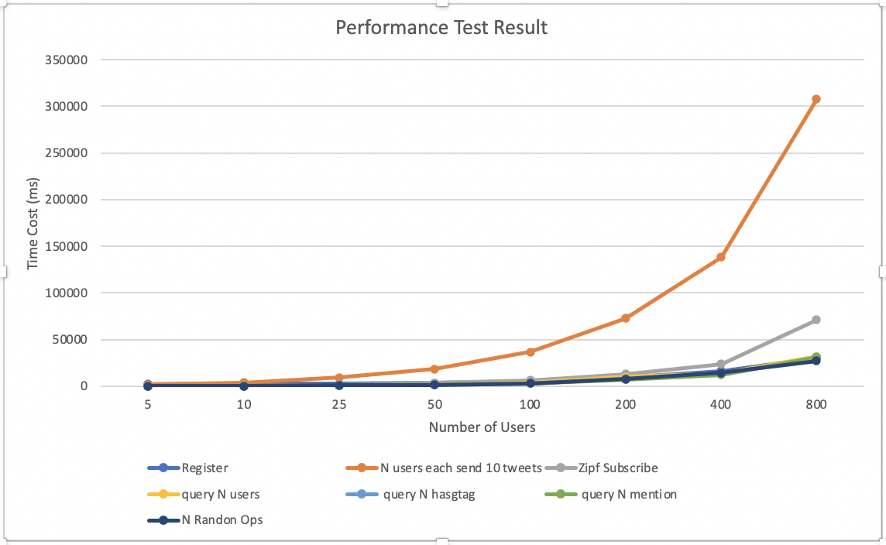
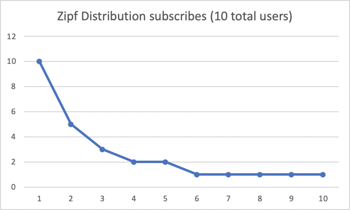

# Project4 Part II

## Team
- Jiajing Liao, 01469951
- Jingzhou Hu, 11319238

## Youtube Video explanation
[https://youtu.be/x27j8ZsE_zE](https://youtu.be/x27j8ZsE_zE)

## Description
We finish **all** requirements of Project 4 Part II

Based on Project4 Part I, we developed a Websocket based API for our Twitter, it route to a specific link address, The body is a JSON string, the "command" field of the JSON will be the command for the Twitter Server, which is exactly the same as Project4 Part I:
```
http://127.0.0.1:8080/twitter

un-encrypted Body: {"command":"reg, ,user1,123456, , , , , "}

encrypted Body: {"command":"pOAbwGSJbIR3SrcUTVTEAu6eyHLzVtYdjibRnEEly570pqpIm6jaoFQbdBy2RTRCdCdnD94uYdE4O5ZpNrkhxXZnp8rFh7bh4XvaGxSvh0/0Bo8CAoKHgtChEOGmzEFG"}
```


We re-write parts of our server using WebSharper to implement the WebSocket interface, which is a extra layer for receiving Websocket Request

We re-write parts of our client to use WebSockets, we replace the AKKA actor to WebSockets sender.

#### Bonus Encryption
Due to the lack of support of RSA-2048 on Fsharp.(Actually we do have RSA-2048 version but there is some issue for F# support, so we choose other encryption method.)For the Encryption part, Ciphertext authenticity, based on.NET Framework, is verified with HMAC SHA256.(AS professor said, we can use some api: https://github.com/tasos-py/AES-Encryption-Classes, which is a Advanced Encryption Standard encryption with good F# support.)

After joining the Encryption, our program is relatively slow.

###### Encryption Display

Client:

```
[Before Encrypt]reg, ,user1,123456, , , , ,
[AfterEncrypted]pOAbwGSJbIR3SrcUTVTEAu6eyHLzVtYdjibRnEEly570pqpIm6jaoFQbdBy2RTRCdCdnD94uYdE4O5ZpNrkhxXZnp8rFh7bh4XvaGxSvh0/0Bo8CAoKHgtChEOGmzEFG
```

Server

```
[BeforeDecrypted:]pOAbwGSJbIR3SrcUTVTEAu6eyHLzVtYdjibRnEEly570pqpIm6jaoFQbdBy2RTRCdCdnD94uYdE4O5ZpNrkhxXZnp8rFh7bh4XvaGxSvh0/0Bo8CAoKHgtChEOGmzEFG
[decrypted Message:]reg, ,user1,123456, , , , ,
```


## Running
There 3 files we provide in ./fs
- `Server.fs` is the server
- `ClientOne.fs` is the client
- `Client.fs` is for performance test

You may run these files in Visual Studio or JetBrains Rider IDE

## Implementation
#### Client
The major responsibility of client is to send the message string to the server, and disply the result string to the screen
#### Server
We build Twitter Server basically by 3 Class: Tweet, User, and Twitter. 
- Tweet is the instance of tweet, identified by System time stamp
- User is the instance of User, identified by username
- Twitter is a Singleton instance, which is consist of many HashMap, in order to speed up the search for "#" and "@"

#### for "#" and "@", HashMap to speed up
Whenever a new Tweet is published, it will be parsed. If it contains "#" or "@", it will then be add to the HashMap.

#### Connecting and disconnecting
We use a `Long Pulling` techniques, every 1 seconds, the actor will try to query the tweets it subscribes, and if there is a difference to the previous result, it will be displayed to the screen

## How to use

#### Command Explanation
Our Client Command is consist of 9 String, seperated by comma ","

9 command format: 
**Very Important**
```
opt+","+POST+","+username+","+password+","+target_username+","+tweet_content+","+queryhashtag+","+at+","+register
```

In order to understand the means of below command, please look at below example 1


#### Example 1: Functionality
Run Server in Jetbrains Rider

Run Client1 in Jetbrains Rider

Run Client2 in Jetbrains Rider

Then Input Below Command line by line into CLient1 and Client2 Seperately
```
reg, ,user1,123456, , , , , 
reg, ,user2,123456, , , , ,
send, ,user1,123456, ,tweet1 @Biden , , ,
send, ,user2,123456, ,tweet2 #Trump , , ,
send, ,user2,123456, ,tweet3 @Biden #Trump , , ,
subscribe, ,user1,123456,user2, , , ,
querying, ,user1,123456, , , , ,
querying, ,user2,123456, , , , ,
#, , , , , ,#Trump, ,
@, , , , , , ,@Biden,
```



#### Example 2: retweet
Input Below Command line by line into CLient Terminal
```
retweet, ,user2,123456, ,tweet3 @Biden #Trump , , , 
querying, ,user2,123456, , , , ,
```



#### Example 3: connect and disconnect
For this example, you can open `user1` as a terminal, open `user2` as another terminal. Then, since `user1` subscribes `user2`, the screen of `user1` will automatically refresh with the latest tweets of `user2`

After disconnecting, it will no longer refresh automatically.

```
connect, ,user1,123456, , , , ,
send, ,user2,123456, ,tweet4, , ,
send, ,user2,123456, ,tweet5, , ,
send, ,user2,123456, ,tweet6, , ,
disconnect, ,user1,123456, , , , ,
send, ,user2,123456, ,tweet7, , ,
```



#### Example 4: Performance Test

`(All performance test is run without Encryption)`

- Firstly, open a Server as mentioned above.
- Then, run ClientPerformanceTest, You can change the 10 to any integer, it represents the number of users

`result10.txt` is Performance test result under 10 users

## Test Measure
All test result obtained from `.fs` file in Jetbrains Rider IDE.
We test time cost of 3 measures, below N is the number of all users:
- register N users
- send 10 tweets for all users, and simulate a Zipf number of subscribes, and query tweets for every users
- Zipf subscribe N users
- query N users
- query N hasgtag
- query N mention
- N random operations

## Result


#### time cost in different test scales
All test result obtained from `.fs` file in Jetbrains Rider IDE.
(milliseconds)

- For each user, we sent 10 tweets "tweet_content+useri_jth @user$ #topic$ " ($ means random)

| N   | Register   | N users each send 10 tweets | Zipf Subscribe | query N users |  query N hasgtag  |  query N mention | N Randon Ops |
|-----|------------|-----------------------------|----------------|---------------|-------------------|------------------|--------------|
| 5   | 2141.059   | 1895.5263                   | 264.5447       | 172.7906      | 177.4282          | 161.5666         | 159.6666     |
| 10  | 3018.0367  | 3693.2198                   | 599.6824       | 349.1778      | 360.9393          | 335.1666         | 310.3909     |
| 25  | 2803.3042  | 9416.3271                   | 1601.2634      | 861.9322      | 850.6924          | 846.5158         | 838.9885     |
| 50  | 3548.9732  | 18599.5518                  | 3276.9638      | 1727.1086     | 1660.3156         | 1621.459         | 1572.446     |
| 100 | 5210.7086  | 36686.9221                  | 6325.7602      | 3359.5298     | 3142.104          | 3216.4934        | 3232.4811    |
| 200 | 9259.367   | 72963.2182                  | 13100.1129     | 10090.295     | 8059.2591         | 7261.9787        | 7464.057     |
| 400 | 16382.2554 | 138322.962                  | 23674.4813     | 13669.3413    | 13222.7872        | 12277.181        | 14167.2872   |
| 800 | 30259.4236 | 307421.683                  | 71005.524      | 31688.8535    | 30536.8718        | 31437.4362       | 27319.604    |



#### number of subscribes, simulate a Zipf distribution



## What is the largest network you managed to deal with
the biggest number of users we tested is 800

## Analysis
Send Tweet cost the most of time, since server will have to parse "@user" and "#topic", this will cost tons of server time. As a result, it's the most time-consuming operations

Zipf Subscribe cost 2nd most time, since it requires total 2*N subscribes operations.

For other operations, it just need N operations, so they don't cost as much time as previous 3 operations.


The difference with Part I is that the overhead of query is not that significant, since WebSocket has bigger packet size than AKKA Message.


## Environment

```
- FSharp.Core 4.5.1
- Akka.FSharp 1.2.0
- Akka.Remote 1.2.0
- FsPickler 3.4.0

- websharper.fsharp: 4.6.0.361
- WebSharper.Suave: 4.6.0.240
- Suave: 2.5.3

- Fsharp.Data 3.0.1

```

```
- MacBook Pro
- 2.3 GHz Dual-Core Intel Core i5
- JetBrains Rider 2020.2
```