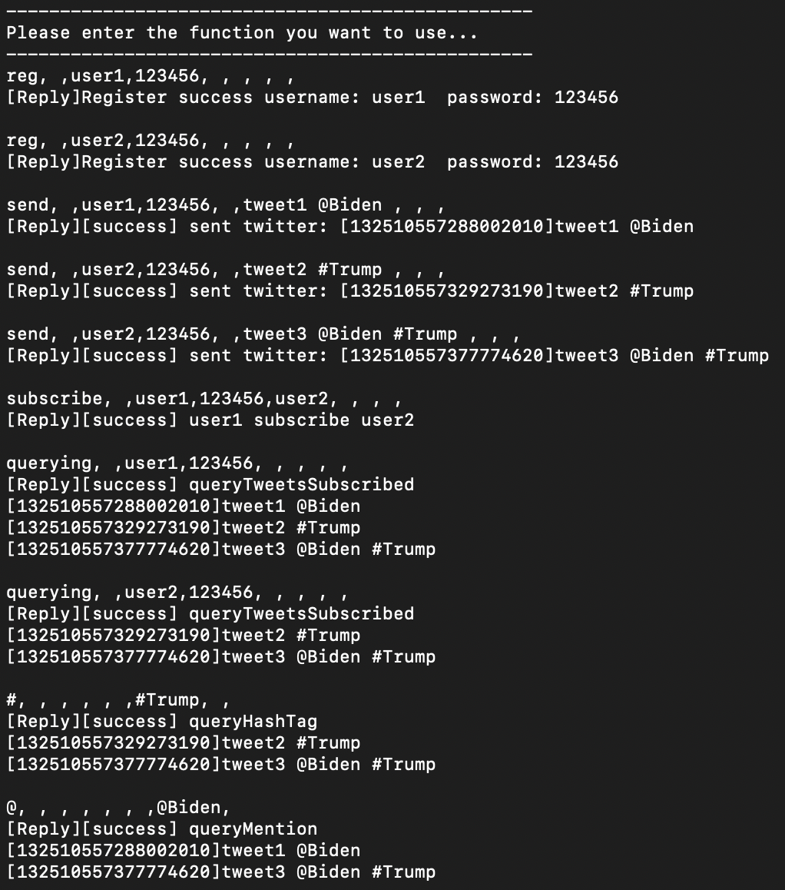
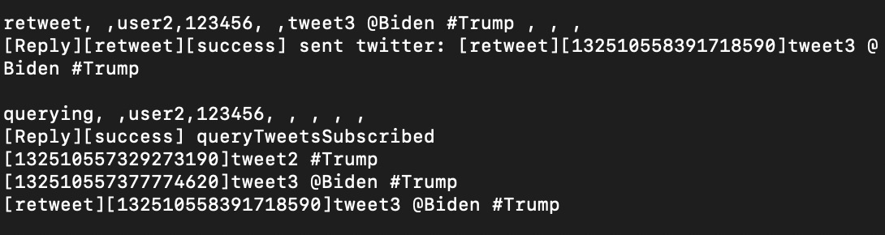
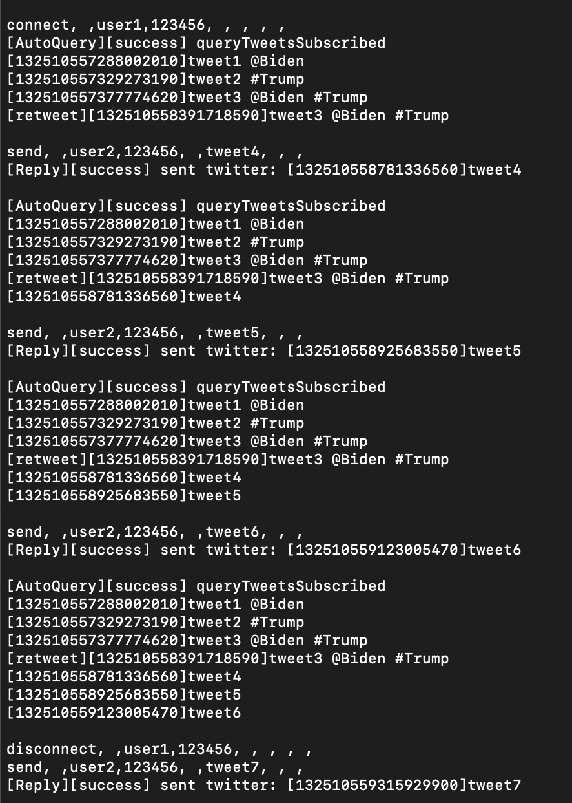
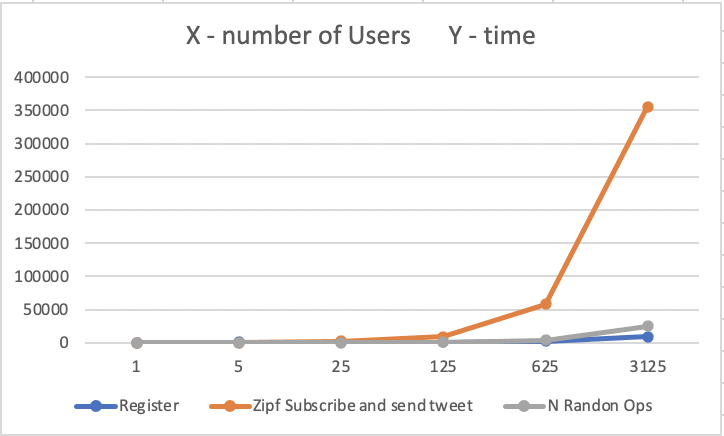
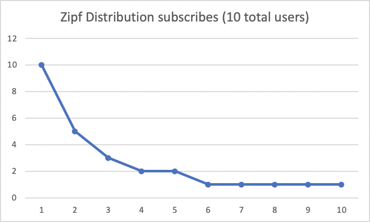

# Project4 Part I

## Team
- Jiajing Liao, 01469951
- Jingzhou Hu, 11319238

## Description
We finish **all** functionality of Project4 Part I requirements.

#### Running options 1
There 3 files we provide in ./fsx
- `AkkaServer.fsx` is the server
- `AkkaClientOne.fsx` is the client
- `AkkaClient.fsx` is for performance test

#### Running options 2
you can also run .fs files in ./fs folder, this requires a Visual Studio or JetBrains Rider IDE

## Implementation
#### Client
We use Akka.actor heavily, the major responsibility of client is to send the message string to the server, and disply the result string to the screen
#### Server
We build Twitter Server basically by 3 Class: Tweet, User, and Twitter. 
- Tweet is the instance of tweet, identified by System time stamp
- User is the instance of User, identified by username
- Twitter is a Singleton instance, which is consist of many HashMap, in order to speed up the search for "#" and "@"

#### for "#" and "@", HashMap to speed up
Whenever a new Tweet is published, it will be parsed. If it contains "#" or "@", it will then be add to the HashMap.

#### Connecting and disconnecting
We use a `Long Pulling` techniques, every 1 seconds, the actor will try to query the tweets it subscribes, and if there is a difference to the previous result, it will be displayed to the screen

## How to use

#### Command Explanation
Our Client Command is consist of 9 String, seperated by comma ","

9 command format: 
**Very Important**
```
opt+","+POST+","+username+","+password+","+target_username+","+tweet_content+","+queryhashtag+","+at+","+register
```

In order to understand the means of below command, please look at below example 1


#### Example 1: Functionality
open 1st terminal as Server
```
dotnet fsi --langversion:preview AkkaServer.fsx
```

open 2nd terminal as Client
```
dotnet fsi --langversion:preview AkkaClientOne.fsx
```

Then Input Below Command line by line into CLient Terminal
```
reg, ,user1,123456, , , , ,
reg, ,user2,123456, , , , ,
send, ,user1,123456, ,tweet1 @Biden , , ,
send, ,user2,123456, ,tweet2 #Trump , , ,
send, ,user2,123456, ,tweet3 @Biden #Trump , , ,
subscribe, ,user1,123456,user2, , , ,
querying, ,user1,123456, , , , ,
querying, ,user2,123456, , , , ,
#, , , , , ,#Trump, ,
@, , , , , , ,@Biden,
```



#### Example 2: retweet
Input Below Command line by line into CLient Terminal
```
retweet, ,user2,123456, ,tweet3 @Biden #Trump , , , 
querying, ,user2,123456, , , , ,
```



#### Example 3: connect and disconnect
For this example, you can open `user1` as a terminal, open `user2` as another terminal. Then, since `user1` subscribes `user2`, the screen of `user1` will automatically refresh with the latest tweets of `user2`

After disconnecting, it will no longer refresh automatically.

```
connect, ,user1,123456, , , , ,
send, ,user2,123456, ,tweet4, , ,
send, ,user2,123456, ,tweet5, , ,
send, ,user2,123456, ,tweet6, , ,
disconnect, ,user1,123456, , , , ,
send, ,user2,123456, ,tweet7, , ,
```



#### Example 4: Performance Test
- Firstly, open a Server as mentioned above.
- Then, run below command, You can change the 125 to any integer, it represents the number of users
```
dotnet fsi --langversion:preview AkkaClient.fsx 125
```

## Test Measure
We test time cost of 3 measures, below N is the number of all users:
- register N users
- send 10 tweets for all users, and simulate a Zipf number of subscribes, and query tweets for every users
- N random operations

## Result

#### time cost in 3 different test scales
(milliseconds)
| N    | Register  | Zipf Subscribe and send tweet | N Randon Ops |
|------|-----------|-------------------------------|--------------|
| 1    | 4.3481    | 76.409                        | 0.0595       |
| 5    | 636.0403  | 310.83                        | 53.6972      |
| 25   | 679.0285  | 2137.0041                     | 363.464      |
| 125  | 942.4426  | 8878.189                      | 568.6302     |
| 625  | 2220.7863 | 58481.078                     | 3725.794     |
| 3125 | 8857.3967 | 355213                        | 25100.87     |



#### number of subscribes, simulate a Zipf distribution



## What is the largest network you managed to deal with
the biggest number of users we tested is 3125

## Analysis
The resigter is pretty fast, since it always cost `O(n)` time

When people start to subscribes many other people, the graph gets complicate. In this scenario, query tweets will be slow, it requires `O(n^2)` time

For random operations, it is almost `O(n)` time


## Environment

```
- FSharp.Core 3.0.2
- Akka.FSharp 1.2.0
- Akka.Remote 1.2.0
- FsPickler 1.2.21
```