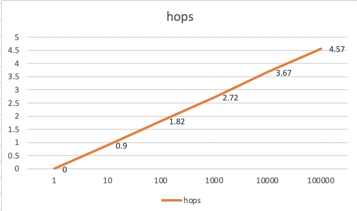

# project3

## Team
- Jiajing Liao, 01469951
- Jingzhou Hu, 11319238

## What is working:

- We diversely generate *numNodes* actors
- At each second, every node will send a message to a random address
- After *numRequests* seconds, the program will report the result and stop

### simplification statement
In this project, we implement the [Pastry](http://rowstron.azurewebsites.net/PAST/pastry.pdf), 
we made below change to make problem simple:
- Our ID range is from [0, 1000000000), this is more straightforward for human understanding.

- For example, when n=10, our code will generate Actor as: 000000000 100000000 200000000 300000000 400000000 500000000 600000000 700000000 800000000 900000000
- Our Code will generate Akka Actor in decimal, which means there is only 0, 1, 2, ..., 9.
- Above simplification has no impact to the final result. 
- we use a Trie to store the routing table, each time the node will compare it's own address with destination address, and then send the message to the first closest node in the Trie
- we use a modified decimal md5 as hash function, truncate leading 10 digits
## How to run the code:
```java
// dotnet fsi --langversion:preview project3.fsx numNodes numRequests
dotnet fsi --langversion:preview project3.fsx 10000 1
```
## What is the largest network you managed to deal with
the largest problem is as below:
```
numNodes is 100000 nodes
numRequests is 1 requests
Running time is: 157751.663500 ms
max hop is 5 hops
min hop is 0 hops
avg hop is 4.579850 hops
```

## Analysis
out data shows that the hops are O(log n)
which is reasonable because each time, the range will shrink by 2^b times.

When `numNodes` is small, numRequests will have impact to final result. However, when it is big, there is no much impact.

## Developing:
- F#
- Akka
    - Akka 1.2.3
    - Akka.FSharp 1.2.3
    - FsPickler 3.4.0
- ASP.Net core - 3.1.403
- JetBrains Rider 2020.2.2
- MacBook Pro 2.3 GHz Dual-Core Intel Core i5
    - OS Name:     Mac OS X
    - OS Version:  10.15
    - OS Platform: Darwin

## Graph Report


## Reference
- [Pastry](http://rowstron.azurewebsites.net/PAST/pastry.pdf)
- [Trie](https://blog.martindoms.com/2016/05/23/prefix-tree-trie-f-sharp)
- [MD5](http://www.fssnip.net/3D/title/MD5-hash)